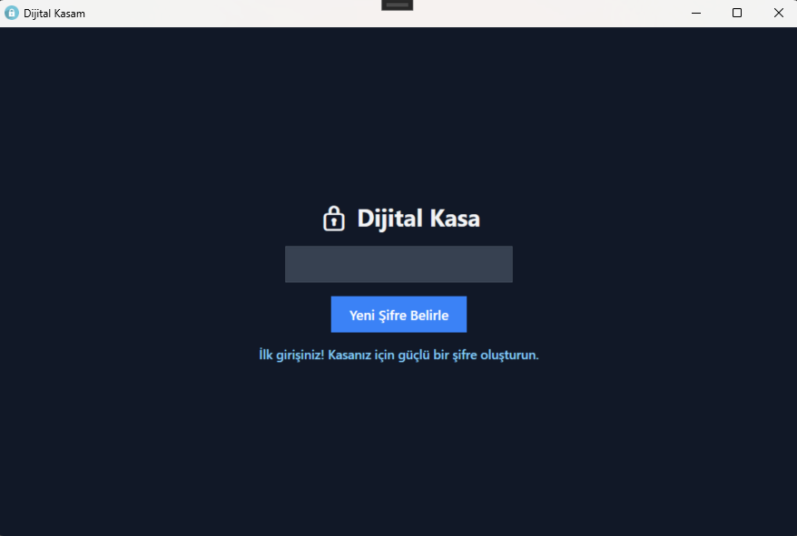
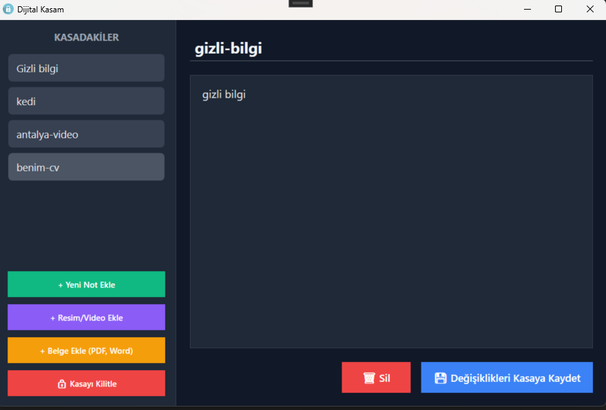

# 🛡️ SecretNotepad - Askeri Düzey Dijital Kasa

> **"Kendi kasanızı, kendi yerelinizde kurun; verilerinizi başkalarının bulutuna değil, kendi kalenize emanet edin."**

SecretNotepad, hassas verilerinizi (notlar, resimler, videolar ve belgeler) internete ihtiyaç duymadan, tamamen kendi bilgisayarınızda en üst düzey şifreleme standartlarıyla saklamanız için geliştirilmiş bir **Dijital Kasa** uygulamasıdır.

## 🚀 Neden SecretNotepad?

Günümüzde verilerimizin dev şirketlerin bulut sunucularında ne kadar güvende olduğu her zaman bir soru işaretidir. Bu proje, **"Sıfır Güven" (Zero-Trust)** felsefesiyle hazırlanmıştır: Veri sizindir, anahtar sizdedir ve her şey sizin yerelinizde (local) olup biter.

## ✨ Teknik Özellikler

* **AES-256 Şifreleme:** Endüstri standardı olan AES-256 algoritmasıyla verileriniz kırılamaz bir zırhla korunur. 
* **PBKDF2 Şifre Türetme:** Giriş şifreniz, **300.000 iterasyonluk** bir döngüden geçirilerek kaba kuvvet (Brute-Force) saldırılarına karşı "erişilemez" hale getirilir.
* **Gömülü Medya Desteği:** Resim ve videolar Base64 formatında direkt kasanın içine gömülür, dışarıda şifresiz iz bırakmaz.
* **Akıllı Temp Yönetimi:** Şifreli bir dosyayı açtığınızda sistem onu anlık olarak çözer ve işiniz bittiği an bellekten ve diskten kalıcı olarak siler.
* **Asenkron Güç:** Dev dosyalar şifrelenirken `async/await` mimarisi sayesinde uygulama arayüzü asla donmaz.
* **Modern Karanlık Tema:** WPF ControlTemplate özellikleri kullanılarak baştan aşağı özelleştirilmiş hacker-style arayüz.

## 🛠️ Kullanılan Teknolojiler

* **Platform:** .NET 10 / C#
* **UI:** WPF (Windows Presentation Foundation) & XAML
* **Kriptografi:** `System.Security.Cryptography`
* **Veri Yapısı:** JSON Serialization

## 🔒 Güvenlik Notu

Bu uygulama **Zero-Knowledge (Sıfır Bilgi)** prensibiyle çalışır. Belirlediğiniz şifreyi unutursanız, kasanın "arka kapısı" veya "şifremi unuttum" özelliği yoktur. Verileriniz sadece sizin anahtarınızla evrenin sonuna kadar korunur.

---

